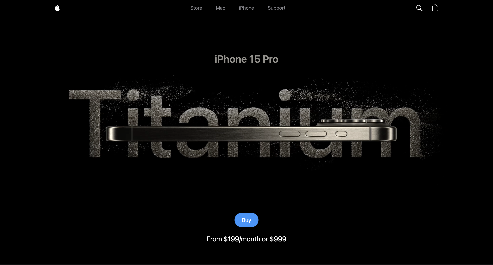

# iPhone 15 Pro Website Clone 🍎

A pixel-perfect clone of Apple's iPhone 15 Pro website with **3D model interactions**, **smooth animations**, and **dynamic color/size customization**. Built with modern web technologies to mirror Apple's premium design.

## ✨ Features
- **Interactive 3D Model**  
  - Change iPhone color (Natural Titanium, Black, White, etc.)
  - Adjust model size with scroll/pinch gestures
- **Cinematic Animations**  
  - GSAP-powered scroll-triggered transitions
  - Smooth hover effects on buttons and UI elements
- **Product Customization**  
  - Dynamic pricing section ("From $199/month or $999")
  - A17 Pro chip performance showcase
- **Responsive Design**  
  - Mobile-first layout using Tailwind CSS

## 🛠️ Tech Stack
- **Frontend**: React
- **Styling**: Tailwind CSS
- **Animations**: GSAP
- **3D Rendering**: Three.js
- **Build Tool**: Vite

## 📸 Screenshots

| Section | Preview |
|---------|---------|
| **Hero Section** |  |
| **Video Carousel** |  |
| **A17 Pro Chip Demo** |  |
| **Phone Info** |  |

## 🎥 Video Demo
[Watch Demo Video](./public/assets/videos/R1.mov)  
[Watch Demo Video](./public/assets/videos/R2.mov)  
*(Click to view screen recording of interactions)*
